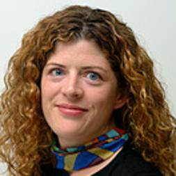
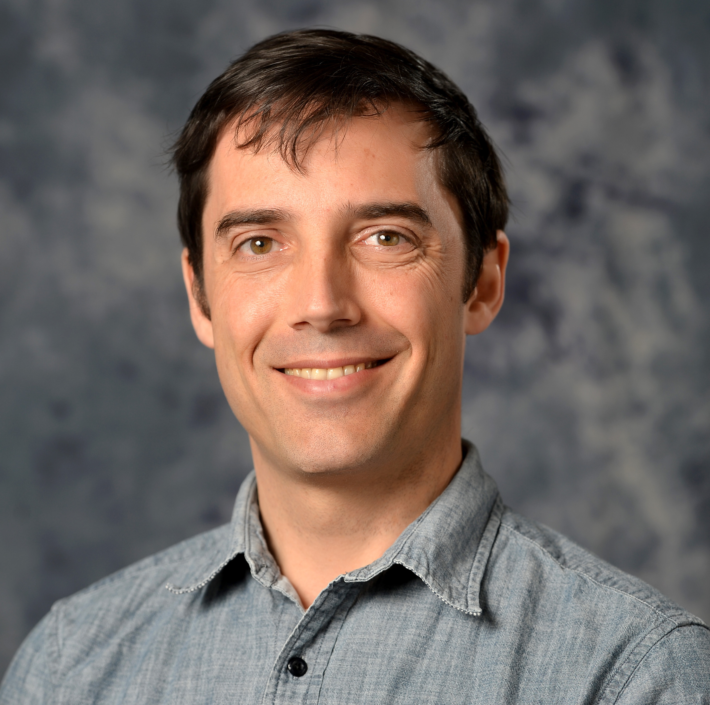
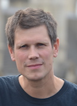

# BioC 2020: Where Software and Biology Connect

When: June 24 - 27, 2020 
What: Developer Day, Main Conference, Symposium 
Where: [venue], Boston, USA 
Slack: [Bioconductor Team][] (`#bioc2020` channel) 
Twitter: [#bioc2020][tweet] 

[tweet]: https://twitter.com/hashtag/bioc2020?f=tweets
[venue]: ./travel-accommodations
[Bioconductor Team]: https://bioc-community.herokuapp.com/

# Code of Conduct

This code of conduct is developed for the Bioc2020 conference. 

## Social media policy

Images and content from talks, workshops, and posters may be shared publicly through social media _unless_ the presenter asks for it not to be. To avoid confusion, presentations not to be shared should be labeled "Do Not Share" on each slide, as should be posters.

## The _Bioconductor_ conference aims to provide a supportive, collegial, and harassment-free environment

_Bioconductor_ is dedicated to providing a supportive, collegial, and harassment-free 
conference experience for everyone, regardless of:
* gender, gender identity and expression, sexual orientation, disability, 
physical appearance, body size, race, age or religion. 
* intellectual position: approaches to data analysis, software preferences, coding style, scientific perspective, etc.

We do not tolerate harassment, intimidation, or bullying of conference participants in talks, 
workshops, poster sessions, social activities, 
or online. Sexual language and imagery is not appropriate for any conference venue, including talks. 
Conference participants violating these rules may be sanctioned or expelled from the conference with no refund, 
at the discretion of the conference organizers. Our anti-harassment policy can be found at: http://bioc2019.bioconductor.org/code_of_conduct

## Examples of unacceptable harassment, intimidation, and bullying behavior

Harassment includes, but is not limited to:

* Making comments, to an audience or personally, that belittle or demean another person
* Sexual images in public spaces
* Stalking or following
* Harassing photography or recording
* Sustained disruption of talks or other events
* Inappropriate physical contact
* Unwelcome sexual attention
* Advocating for, or encouraging, any of the above behaviour 

Intimidation and bullying include, but are not limited to:

* Aggressive or browbeating behavior directed at someone during a public presentation
* Mocking or insulting another person's intellect, work, perspective, or question/comment
* Making reference to someone's gender, gender identity and expression, sexual orientation, disability, 
physical appearance, body size, race, age, religion, or other personal attribute in the context of a scientific 
discussion
* Deliberately making someone feel unwelcome

### Enforcement

Participants asked to stop any harassing behavior are expected to comply immediately.

If a participant engages in harassing behaviour, event organisers retain the right to take any actions to keep the event a welcoming environment for all participants. This includes warning the offender or expulsion from the conference with no refund. 

Event organisers may take action to redress anything designed to, or with the clear impact of, disrupting the event or making the environment hostile for any participants. 

We expect participants to follow these rules at all event venues and event-related social activities. We think people should follow these rules outside event activities too! 

### Reporting

If someone makes you or anyone else feel unsafe or unwelcome, please report it as soon as possible. 
Harassment and other code of conduct violations reduce the value of our event for everyone. 
We want you to be happy at our event. People like you make our event a better place. 

You can make a report either personally or anonymously. 

#### Anonymous or Non-anonymous Report

You can make an anonymous or non-anonymous report here: https://tinyurl.com/bioccomplaint. It is a free-form text box that will be forwarded to conference organizers.

We can't follow up an anonymous report with you directly, but we will fully investigate it and take whatever action is necessary to prevent a recurrence. 

#### Personal Report

You can make a personal report with any of the conference anti-harassment committee: Aedin Culhane, Levi Waldron, and Laurent Gatto.

When taking a personal report, our staff will ensure you are safe and cannot be overheard. They may involve other event staff to ensure your report is managed properly. Once safe, we'll ask you to tell us about what happened. This can be upsetting, but we'll handle it as respectfully as possible, and you can bring someone to support you. You won't be asked to confront anyone and we won't tell anyone who you are. 

Our team will be happy to help you contact hotel/venue security, local law enforcement, local support services, provide escorts, or otherwise assist you to feel safe for the duration of the event. We value your attendance. 

    Conference organizers: workshop@bioconductor.org
    Anonymous complaints: tinyurl.com/bioccomplaint
    Local law enforcement: 911
    Local sexual assault hot line: 212-227-3000
    [Phone number for conference security or organizers] 
    [Phone number for hotel/venue security] 
    [Local emergency and non-emergency medical (e.g., urgent care, day clinic)] 

| Photo | Name |
|---|---|---|
|  | Aedin Culhane <[aedin@jimmy.harvard.edu][2]> |
|  | Levi Waldron  <[lwaldron.research@gmail.com][4]> |
|  | Laurent Gatto <[laurent.gatto@uclouvain.be][6]> |

[0]: mailto:workshop@bioconductor.org?subject=BioC2019%20code-of-conduct
[2]: mailto:aedin@jimmy.harvard.edu?subject=BioC2019%20code-of-conduct
[4]: mailto:lwaldron.research@gmail.com?subject=BioC2019%20Code-of-conduct
[6]: mailto:laurent.gatto@uclouvain.be?subject=BioC2019%20Code-of-conduct
