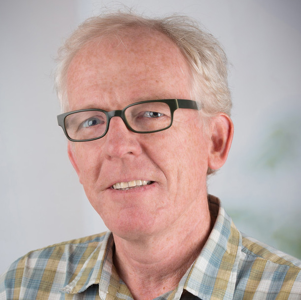
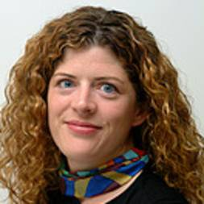
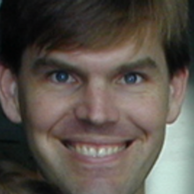

# BioC 2019: Where Software and Biology Connect

When: July 29 - 31, 2020 
What: Developer Day, Main Conference  
Where: [TBA][venue], Boston, USA 
Slack: [Bioconductor Team][] (`#bioc2020` channel) 
Twitter: [#bioc2020][tweet] 

[tweet]: https://twitter.com/hashtag/bioc2020?f=tweets
[venue]: ./travel-accommodations
[Bioconductor Team]: https://bioc-community.herokuapp.com/

## Organizing committee

| Photo | Name | Affiliation |
|---|---|---|
| | Kelly Ruggles | Director Academic Programs, Sackler Institute of Graduate Biomedical Sciences and Assistant Professor of Medicine, NYU School of Medicine |
| | Thomas S. Carroll | Head of Bioinformatics, The Rockefeller University |
|  | Lorena Pantano | Research Scientist, Biostatistic department at the Harvard TH Chan School of Public Health |
|  | Matthew McCall | Assistant Professor of Biostatistics and Biomedical Genetics, University of Rochester Medical Center |
|  | Peter Hickey | Senior Research Officer, Walter and Eliza Hall Institute of Medical Research, Australia |
|  | Levi Waldron   | Associate Professor of Biostatistics, Graduate School of Public Health and Health Policy and Institute for Implementation Science in Public Health, City University of New York|
|  | Martin Morgan | Professor, Roswell Park Comprehensive Cancer Center. Project leader, Bioconductor |
|  | Aedin Culhane  | Dana-Farber Cancer Institute, Harvard TH Chan School of Public Health |
|  | Laurent Gatto  | Professor of bioinformatics, de Duve Institute, UCLouvain, Belgium |
|   | Sean Davis | Senior Associate Scientist, Center for Cancer Research, National Cancer Institute |
|  | Vince Carey | Professor of Medicine, Channing Division of Network Medicine, Brigham and Women's Hospital, Harvard Medical School |
