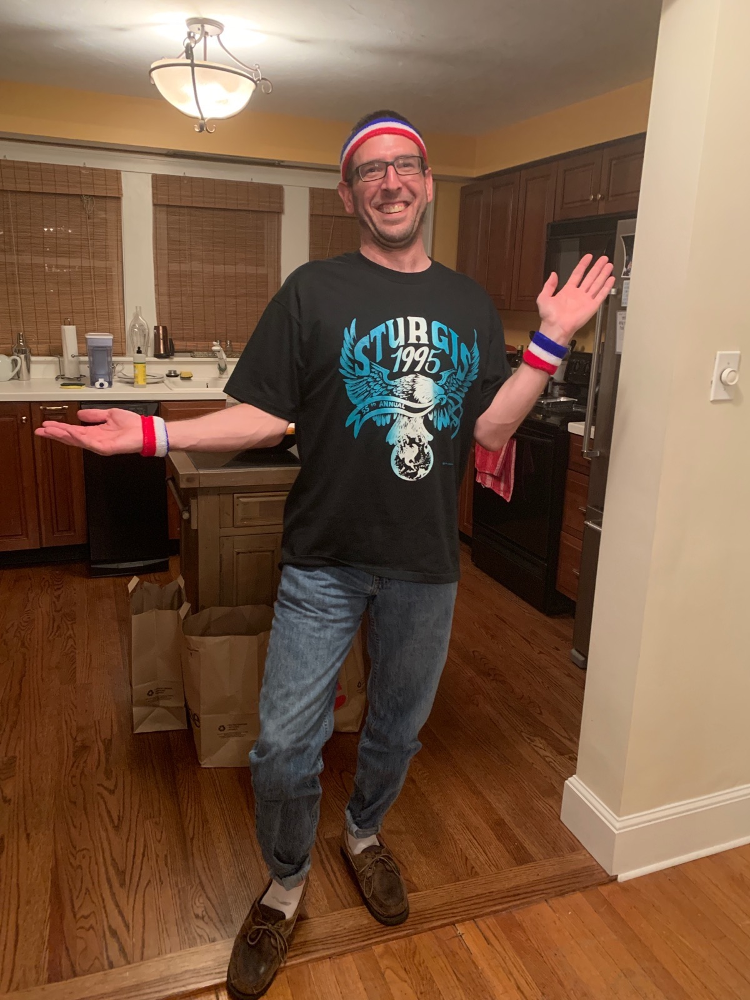
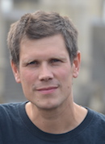
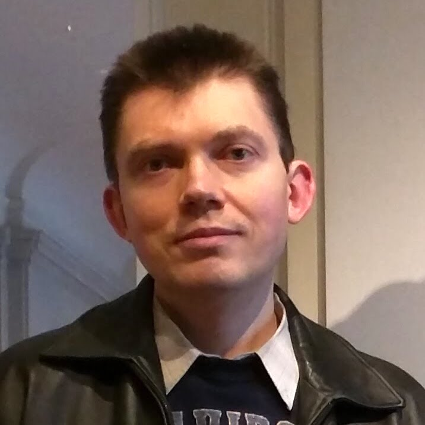



## Members of organizing committees

**Bold** highlights leaders of the committees

| Photo                                                        | Name                    | Affiliation                                                             | Committee                                                                                                                              |
|--------------------------------------------------------------|-------------------------|-------------------------------------------------------------------------|----------------------------------------------------------------------------------------------------------------------------------------|
|                     | Aedin Culhane           | Dana-Farber Cancer Institute, Harvard TH Chan School of Public Health   | **Co-chair**, **Sponsorship**, Program: Competitive component, Program: non-competitive component, Code of Conduct                     |
|  | Anthony Federico        |                                                                         | Website, Education/Workshop                                                                                                            |
|  | Ayush Raman             |                                                                         | Outreach, Education/Workshop, Program: Competitive component, Program: non-competitive component                                       |
|          | Charlotte Soneson       | Friedrich Miescher Institute for Biomedical Research                    | **Program: non-competitive component**, Website, Education/Workshop, Program: Competitive component                                    |
|  | Chiaowen Joyce Hsiao    |                                                                         | Program: Competitive component, Program: non-competitive component                                                                     |
|  | Deepak Tanwar           |                                                                         | Program: Competitive component, Program: non-competitive component                                                                     |
|  | Erica Feick             |                                                                         | **Outreach**, Code of Conduct                                                                                                          |
|  | Frederick Boehm         |                                                                         | Outreach, Website, Education/Workshop, Program: Competitive component, Program: non-competitive component, Code of Conduct             |
|  | Hector Corrada Bravo    |                                                                         |                                                                                                                                        |
|  | Helena Crowell          | Institute of Molecular Life Sciences, University of Zurich, Switzerland | Website, Program: Competitive component, Program: non-competitive component, Code of Conduct                                           |
|  | John Hutchinson         |                                                                         | Outreach                                                                                                                               |
|  | Lauren Hsu              |                                                                         | Education/Workshop, Program: Competitive component, Program: non-competitive component, Code of Conduct                                |
|                   | Laurent Gatto           |                                                                         |                                                                                                                                        |
|               | Levi Waldron            | CUNY Graduate School of Public Health and Health Policy                 | **Co-chair**, **Code of Conduct**, Education/Workshop, Program: Competitive component, Program: non-competitive component, Sponsorship |
|            | Lorena Pantano          | eGenesis, MA                                                            | **Website**, Education/Workshop, Program: non-competitive component, Code of Conduct                                                   |
|              | Lori Shepherd           | Roswell Park Comprehensive Cancer Center                                | Website, Education/Workshop, Program: Competitive component, Program: non-competitive component                                        |
|  | Marcel Ramos            |                                                                         | Education/Workshop                                                                                                                     |
|              | Martin Morgan           | Roswell Park Comprehensive Cancer Center                                | Website, Program: non-competitive component, Sponsorship, Businness administration, Bioconductor organization                          |
|            | Matthew McCall          |                                                                         | **Program: Competitive component**                                                                                                     |
|           | Mikhail Dozmorov        | Virginia Commonwealth University                                        | Website, Education/Workshop, Program: Competitive component, Program: non-competitive component                                        |
|  | Nathan Sheffield        |                                                                         | Education/Workshop                                                                                                                     |
|                | Oriol Senan             |                                                                         | Website, Education/Workshop                                                                                                            |
|               | Peter Hickey            |                                                                         | Code of Conduct                                                                                                                        |
|                   | Qian Liu                | Roswell Park Comprehensive Cancer Center                                | Website, Program: Competitive component, Program: non-competitive component, Sponsorship                                               |
|  | Rafael Irizarry         |                                                                         | Program: non-competitive component, Sponsorship                                                                                        |
|  | Ricardo de Matos Simoes |                                                                         | Education/Workshop, Program: Competitive component, Program: non-competitive component                                                 |
|                 | Sean Davis              | National Cancer Institute, National Institutes of Health                | **Education/Workshop**                                                                                                                 |
|                | Simina Boca             | Georgetown University                                                   | Outreach, Website, Education/Workshop, Program: Competitive component, Program: non-competitive component                              |
|  | Simone Bell             |                                                                         | **Program: non-competitive component**, Sponsorship                                                                                    |
|   | Tom Carroll             |                                                                         |                                                                                                                                        |
|            | Venu Thatikonda         | German Cancer Research Center, Heidelberg                               | Outreach, Website                                                                                                                      |
|              | Vincent Carey           |                                                                         |                                                                                                                                        |
|  | Zhezhen Wang            |                                                                         | Outreach, Website, Education/Workshop                                                                                                  |
